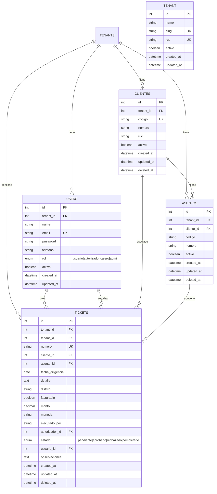

# Legaltec ERP — Diagrama Entidad-Relación (ERD)

> Módulo 1: Tickets Administrativos

## Relaciones

| Relación | Tipo | Descripción |
|---|---|---|
| Tenant → Users | 1:N | Un tenant tiene muchos usuarios |
| Tenant → Clientes | 1:N | Un tenant gestiona muchos clientes |
| Tenant → Tickets | 1:N | Un tenant tiene muchos tickets |
| Users → Tickets (crea) | 1:N | Un usuario crea muchos tickets |
| Users → Tickets (autoriza) | 1:N | Un usuario autoriza muchos tickets |
| Clientes → Asuntos | 1:N | Un cliente tiene muchos asuntos |
| Clientes → Tickets | 1:N | Un cliente genera muchos tickets |
| Asuntos → Tickets | 1:N | Un asunto contiene muchos tickets |

## Reglas de Negocio

1. `codigo` en Clientes es único por tenant (3 dígitos)
2. `codigo` en Asuntos es único por cliente (formato NNN-NNN)
3. `numero` en Tickets es único (formato TKT-000001)
4. `estado` sigue el flujo: pendiente → aprobado/rechazado → completado
5. Soft deletes en clientes, asuntos y tickets (nunca se borran físicamente)